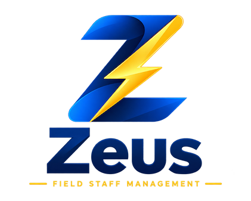
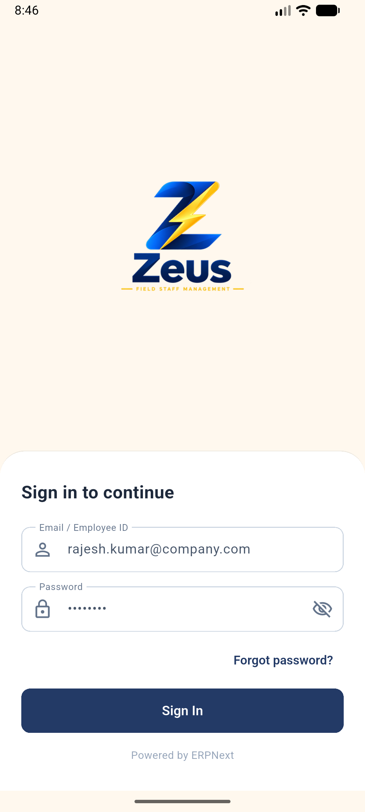
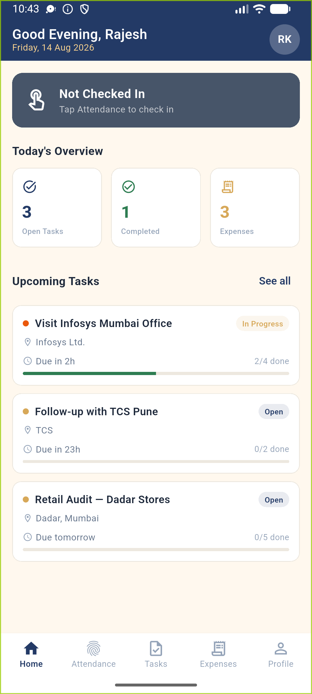
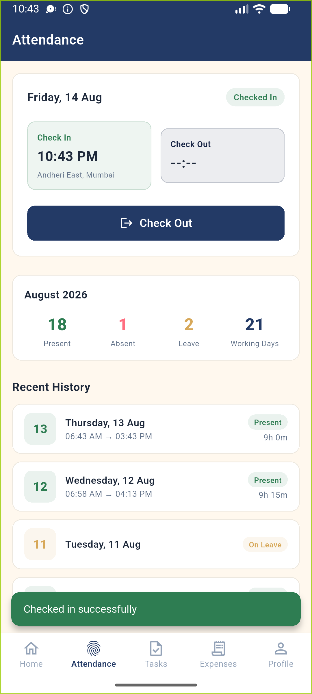
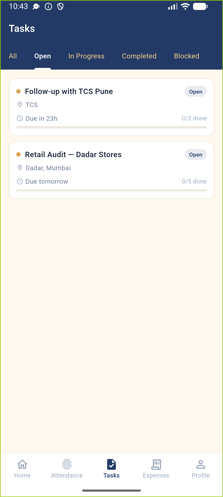
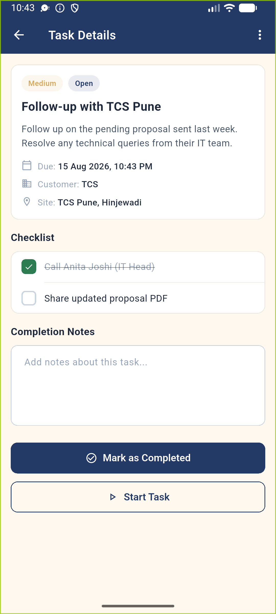
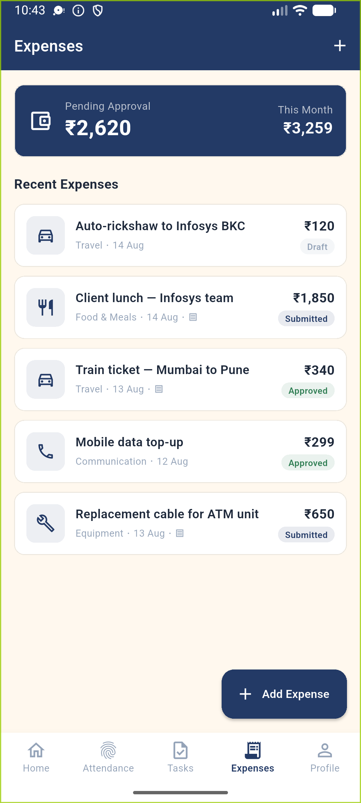
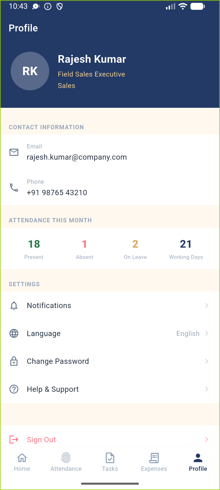

  

# Zeus — Field Staff Management

> Track attendance, tasks, and on-ground activity in real time. Built for field teams running on ERPNext.

Zeus is a Flutter mobile app for field staff — sales reps, service technicians, site supervisors, delivery agents — who spend their working day away from a desk. It connects directly to ERPNext as the backend, giving management live visibility into attendance, task progress, and expenses without WhatsApp updates or paper registers.

---

## Screenshots

<table>
  <tr>
    <td align="center" width="33%">
       
      <b>Sign In</b> 
      ERPNext-backed login with email or Employee ID
    </td>
    <td align="center" width="33%">
       
      <b>Home Dashboard</b> 
      Daily summary — attendance status, open tasks, and pending expenses at a glance
    </td>
    <td align="center" width="33%">
       
      <b>Attendance</b> 
      One-tap check-in/out with GPS capture, monthly summary, and history
    </td>
  </tr>
  <tr>
    <td align="center" width="33%">
       
      <b>Task List</b> 
      Filter tasks by status — Open, In Progress, Completed, Blocked
    </td>
    <td align="center" width="33%">
       
      <b>Task Detail</b> 
      Interactive checklist, completion notes, and one-tap status updates
    </td>
    <td align="center" width="33%">
       
      <b>Expenses</b> 
      Submit claims by category with receipt tracking and approval status
    </td>
  </tr>
  <tr>
    <td align="center" width="33%">
       
      <b>Profile</b> 
      Personal info, monthly attendance stats, and app settings
    </td>
    <td></td>
    <td></td>
  </tr>
</table>

---

## Who is Zeus for?

| Role | How Zeus helps |
|---|---|
| **Field Sales Executive** | See today's tasks, log visits, submit travel expenses — all from the field |
| **Service Technician** | Receive job assignments, complete checklists, capture completion notes on-site |
| **Site Supervisor** | Check in at site, track daily task progress, flag blockers instantly |
| **Delivery / Collection Agent** | Mark attendance, log stops, submit expense claims with receipts |
| **Field Manager** | View team attendance, track task completion, approve expenses — via ERPNext |

---

## Core Features (v1.0)

### Attendance
- One-tap check-in and check-out with GPS location capture
- Monthly attendance summary — Present, Absent, Leave, Working Days
- Full attendance history with duration per day

### Task Management
- View tasks assigned from ERPNext — title, priority, due date, linked customer/site
- Filter by status: All · Open · In Progress · Completed · Blocked
- Interactive checklist items with progress tracking
- Add completion notes and update status directly from the app
- Geo-verification flag for tasks that require on-site presence

### Expenses
- Submit expense claims by category: Travel, Food, Accommodation, Communication, Equipment
- Track approval status: Draft → Submitted → Approved / Rejected
- Receipt attachment indicator
- Pending approval total visible at a glance

### Profile
- Personal and contact information
- Monthly attendance at-a-glance stats
- App settings (notifications, language, password)

---

## Roadmap

| Phase | Scope |
|---|---|
| **v1.0 (current)** | Attendance, Tasks, Expenses, Dashboard, Profile |
| **v1.1** | Visit / activity logs, configurable Forms & Checklists, map view, route planning |
| **v1.2** | Offline-first sync, geofencing enforcement, push notifications, iOS release |

---

## Backend

Zeus uses **ERPNext** as its system of record. The companion ERPNext app handles:
- DocTypes for Attendance, Tasks, Visit Logs, Expense Claims, Journey Plans
- Manager dashboards and reports (Workspaces, List Views)
- Approval workflows for expenses and attendance regularization
- Role-based access — staff see only their own data; managers see their team

---

*Built by [Fafadia Tech](https://fafadiatech.com) · Powered by ERPNext*
